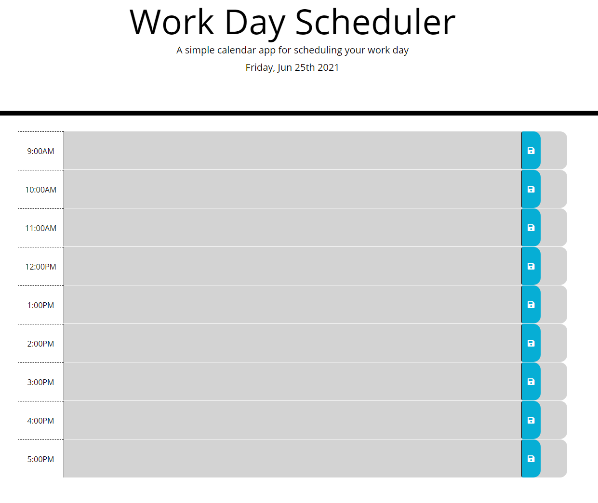

# Work Day Scheduler



## About

This application allows a user to enter items that they will be working on for each hour of a work day. With this application, a user can store their text using the save button to local storage so it stays even when refreshing the browser or closing it and coming back. 

## User Story

```md
As an employee with a busy schedule
I want to add important events to a daily planner
So that I can manage my time effectively
```

## Technologies Used

- Javascript
- CSS
- HTML
- Bootstrap
- jQuery
- Moment
 

## Links 

- GitHub: https://github.com/akoster15/work-day-scheduler
- Deployed: https://akoster15.github.io/work-day-scheduler/